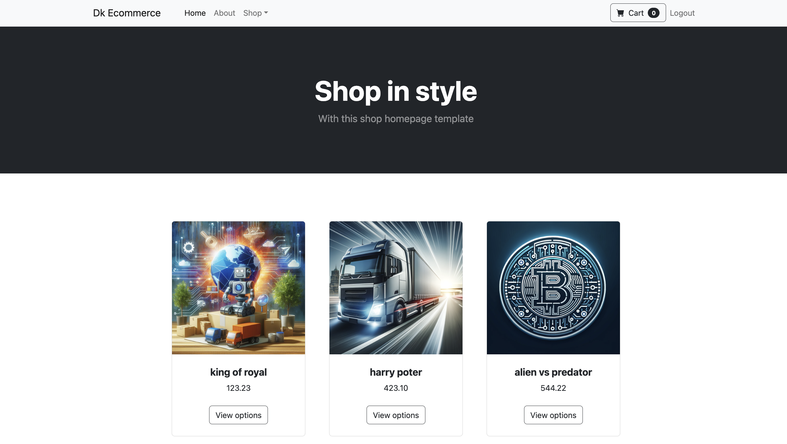

DRF Ecommerce
DRF Ecommerce - это проект интернет-магазина, построенный на Django Rest Framework. Проект предоставляет функционал для регистрации пользователей, управления товарами, оформления заказов и отзывов.

Описание проекта
DRF Ecommerce представляет собой полнофункциональный интернет-магазин, который позволяет пользователям регистрироваться, просматривать товары, оформлять заказы и оставлять отзывы. Проект разработан с использованием Django и Django Rest Framework, что обеспечивает высокую производительность и расширяемость.

Установка
Следуйте инструкциям ниже, чтобы установить и запустить проект на вашей машине.

Предварительные требования
Python 3.8 или выше
PostgreSQL
virtualenv


Использование
После установки и запуска сервера вы можете использовать API для взаимодействия с магазином.

Основной функционал
Регистрация и авторизация пользователей
Управление товарами через админ панель
Просмотр товаров
Оформление заказов
Оставление комментариев и отзывов
Примеры запросов


Получение списка товаров
```
GET /api/products/
```


Создание нового заказа

```
POST /api/orders/
{
    "product": 1,
    "customer": 1,
    "quantity": 2,
    "address": "123 Main St",
    "phone": "1234567890"
}
```


