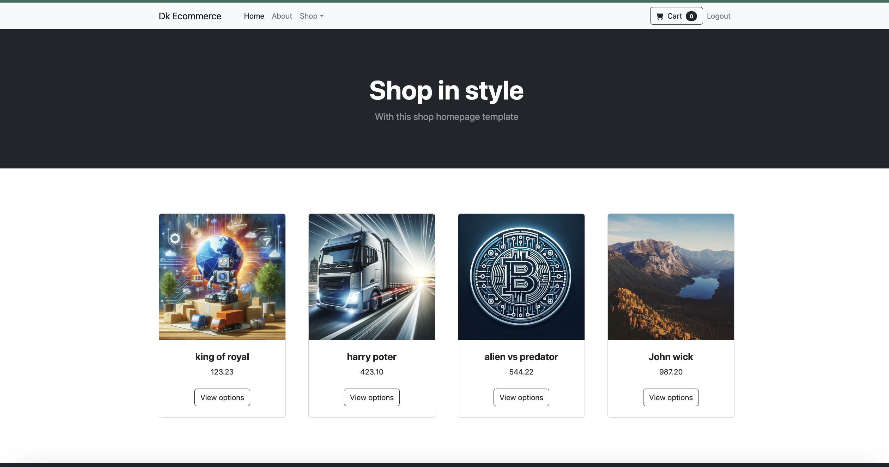
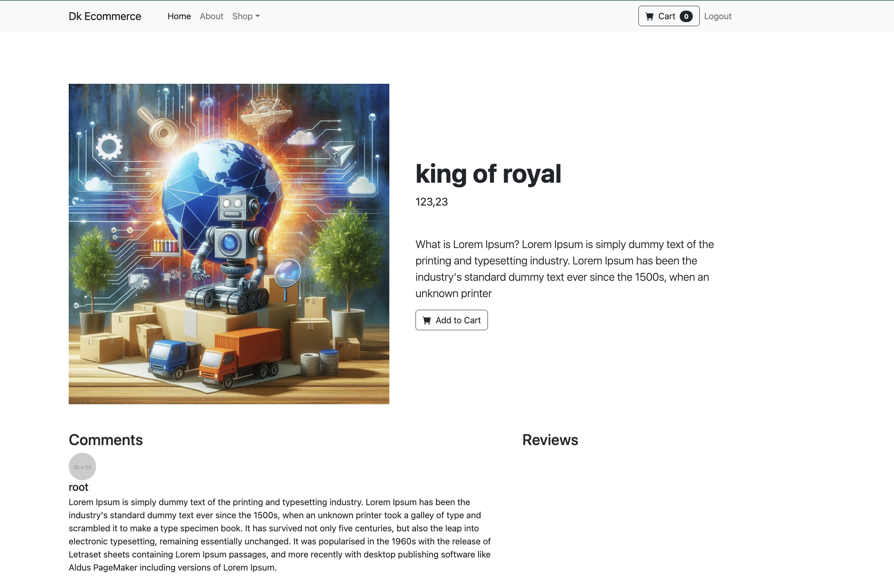

# DRF Ecommerce 🛒

DRF Ecommerce is an online store project built with Django Rest Framework. The project provides functionality for user registration, product management, order processing, and reviews.

## Table of Contents 📑

- [Project Description](#project-description)
- [Installation](#installation)
- [Usage](#usage)
- [Testing](#testing)
- [Contributing](#contributing)
- [License](#license)

## Project Description 📜

DRF Ecommerce is a full-featured online store that allows users to register, browse products, place orders, and leave reviews. The project is developed using Django and Django Rest Framework, ensuring high performance and scalability.

## Installation 🔧

Follow the instructions below to install and run the project on your machine.

### Prerequisites 📋

- Python 3.8 or higher
- PostgreSQL
- virtualenv

### Installation 📦

1. Clone the repository
2. Create a virtual environment
3. Install dependencies
4. Configure the database

## Usage 🚀

After installation and starting the server, you can use the API to interact with the store.

### Main Features 📌

- User registration and authentication
- Product management via admin panel
- Browsing products
- Placing orders
- Leaving comments and reviews

### Example Requests 📈

#### Get a list of products

## Testing 🧪

Provide details on how to run tests for the project.

## Contributing 🤝

Provide guidelines on how to contribute to the project.

## License 📜

This project is licensed under the MIT License - see the LICENSE file for details.

